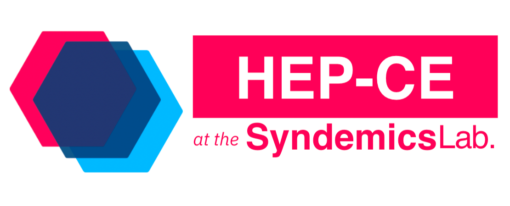

# Syndemics Lab at Boston Medical Center

Welcome to the [Syndemics Lab](https://syndemicslab.org). Under Lead Principal Investigator Benjamin P. Linas, we conduct research as part of Boston Medical Center.

## What We Do
Our team studies synergistic epidemics, or *syndemics*, with a particular focus on Hepatitis C Virus (HCV), the Human Immunodeficiency Virus (HIV), and substance use disorder.

Our work is centered on using simulation and cost-effectiveness analysis methods to evaluate current public health guidelines and policies, primarily through use of our simulation models, RESPOND and HEP-CE.

### RESPOND

**R**esearching **E**ffective **S**trategies to **P**revent **O**pioid **D**eath (`RESPOND`) is a compartmental, cohort-based simulation model intended to represent a population with opioid use disorder through its movements on and off of treatments.

### HEP-CE

**Hep**atitis C **C**ost **E**ffectiveness (`HEP-CE`) is a health economics Markov Chain Monte Carlo micro-simulation model focused on studying the syndemic of opioid use disorder and the hepatitis C virus (HCV).

## Syndemics Lab Dictionary
The Syndemics Lab provides a [dictionary](https://bmcorg-my.sharepoint.com/:w:/g/personal/matthew_carroll_bmc_org/ESQbDqLmKg9Agmj3YprAg7EB-VTvxtY9mQZ_3RyZWKnr7Q?e=h3GFgv) of terminology and acronyms commonly used by the team.
